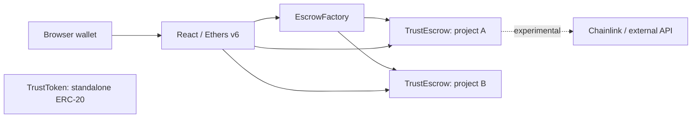

# TrustDApp

**An Ethereum escrow prototype with isolated contracts, on-chain approvals, and a bilingual Persian/English dashboard.**

TrustDApp explores how an employer and a contractor can lock ETH in a dedicated escrow and resolve payment through participant approvals. It combines a Solidity/Hardhat backend with a React/Vite client on Sepolia.

> **Portfolio / testnet project — not audited or production-ready.** Manual escrow is implemented. Oracle arbitration is experimental, not a verified end-to-end service. Never use real funds. See [security limitations](docs/threat-model.md).

## Engineering highlights

- **Factory pattern:** each project gets an isolated `TrustEscrow` instance and ETH balance.
- **Explicit lifecycle:** funded escrows transition to completed or refunded states.
- **Role-based approvals:** manual resolution requires two distinct approvals among employer, contractor, and arbiter for the same outcome.
- **Wallet controls:** connect an injected Ethereum wallet, request account selection, disconnect the application, and react to account/network changes. A green animated indicator identifies the connected account; permission support depends on the wallet.
- **Responsive Persian UI:** a dark RTL workspace places creation and project management side by side on wider screens and uses labeled project cards on smaller screens. Reduced-motion preferences disable the connection animation.
- **Language selection:** switch between Persian and English without resetting the wallet or forms; selection is saved locally, and document direction and statistics follow the chosen language.
- **Dashboard visibility:** factory-wide contract counts, active registered budgets, participant details, arbitration modes, approval badges, and Sepolia Etherscan links for accounts, escrows, and the Factory.
- **Experimental Oracle controls:** HTTPS API URL and JSON field path inputs, request submission, status messages, vote reads where supported, and explicit LINK-cost and service-availability warnings.
- **Independent token:** `TrustToken` has a fixed 100 million TRUST supply. It is **not** used for escrow, fees, payments, or balance display in this version.

## Architecture



`EscrowFactory` is defined inside `TrustEscrow.sol`. `EscrowOracle.sol` is a legacy milestone prototype, not the active dashboard contract.

## Status

| Area | Current status |
| --- | --- |
| Factory and manual escrow | Implemented; automated escrow tests still needed |
| Dashboard | Responsive layout, creation/approval controls, wallet switching/disconnect, statistics, participant details, and explorer links; real-wallet/browser acceptance testing pending |
| Oracle mode | Two-vote logic locally tested; frontend API/request/vote controls and request/status script; successful live fulfillment not verified |
| TRUST token | Standalone ERC-20; five tests; no DApp integration |
| CI / frontend tests | Not configured |
| Hosted demo / screenshots | Not published here yet |
| Audit / mainnet release | Not available |

## Quick start

Use **Node.js 22.22.1** (validated locally), npm, and an injected browser wallet for interactive Sepolia use. Compile and token tests need no private key.

```bash
git clone https://github.com/Teteration/Escrow-Pilot.git
cd Escrow-Pilot
cd escrow-pilot
npm ci
npx hardhat compile
npx hardhat test
cd ../frontend
npm ci
npm run lint
npm run dev
```

Open the address printed by Vite. The client uses the checked-in Factory address in `frontend/src/contracts/contract-address.json`; its live availability is not guaranteed. Use fresh test wallets and deploy your own Factory when needed.

**Read before deploying:** [deployment guide](docs/deployment.md). The Factory script overwrites the frontend address map.

## Repository map

```text
escrow-pilot/
  contracts/          Escrow, embedded Factory, legacy Oracle, standalone token
  scripts/            Separate Factory and token deployments
  test/               Token and focused Oracle vote regression tests
  hardhat.config.js   Solidity and Sepolia configuration
frontend/
  src/                Dashboard, styles, exported contract interfaces
docs/                 Architecture, setup, deployment, tests, risks, decisions
```

## Documentation

- [Frontend skills and initial interface review](docs/frontend-skills.md)
- [Project status and continuation on another computer](docs/project-handover.md)
- [Architecture and state transitions](docs/architecture.md)
- [Local development](docs/local-development.md)
- [Deployment and contract exports](docs/deployment.md)
- [Tests and validation](docs/testing.md)
- [Threat model and limitations](docs/threat-model.md)
- [Sepolia Oracle live-test evidence](docs/oracle-live-test.md)
- [Roadmap](docs/roadmap.md)
- [Decision: token separation](docs/decisions/0001-standalone-token.md)
- [Contributing](CONTRIBUTING.md) · [Security policy](SECURITY.md)

## Design trade-offs

Isolated contracts simplify project accounting but cost more gas than a shared registry. Direct ETH transfers keep settlement simple but let a recipient that rejects ETH block payout. Oracle data cannot by itself prove acceptable delivery of off-chain work. These constraints are documented, not presented as solved problems.

## License

[MIT](LICENSE) for original project code. Dependencies retain their own licenses.
## Release version

Current UI release: **1.1.0** (`V1.1.0`). See [release notes](CHANGELOG.md). This remains an unaudited testnet pilot, not a mainnet-ready release.
