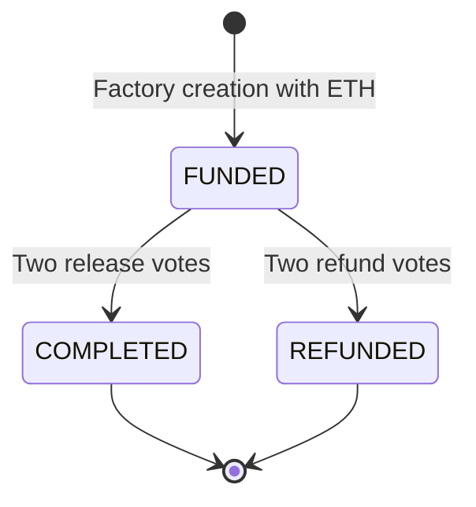

# Architecture

## Active system

The client connects an injected wallet to Sepolia, creates an Ethers v6 signer, and constructs the Factory using its address and ABI. `getAllEscrows()` returns addresses; the dashboard reads roles, budget, state, mode, and approval mappings.

`EscrowFactory`, defined in `escrow-pilot/contracts/TrustEscrow.sol`, creates a payable `TrustEscrow`, records it, and emits `EscrowCreated`. The employer is the creating wallet; submitted ETH becomes the budget.

## State machine

State changes before ETH transfer. A failed transfer reverts the transaction, including the final approval. This is not proof that all security risks are eliminated.

## Manual mode

Employer and contractor must differ; arbiter must differ from both. Any two roles can approve release, or any two can approve refund. A wallet cannot approve the same outcome twice. Release/refund votes are independent: a participant can vote for both while funded. The first outcome reaching its threshold settles the escrow.

Release pays contractor; refund pays employer. Terminal states reject further resolution. There is no deadline, partial payout, unilateral cancellation, or migration.

## Experimental Oracle mode

Fixed Sepolia LINK/Oracle addresses and a job ID are initialized. Employer or contractor can request a decision with a caller-supplied API URL and JSON path. Requests require LINK in that escrow; deployment scripts do not fund it.

Chainlink fulfillment validates the request source. The first valid decision (`1` release, `2` refund) records one immutable Oracle vote. One matching employer/contractor vote is also required, in either order. Two human votes can still settle. Duplicate, invalid, or late authenticated responses add no votes; invalid responses allow a new request. Manual arbiter is normalized to zero in Oracle mode. The GET uint256 job uses `times=1`. These changes require fresh deployment; old instances retain their original behavior.

The UI allows Oracle-mode creation but has no request operation. Node/job compatibility, availability, source neutrality, and funding are unverified. See the [threat model](threat-model.md).

## Separate and historical components

- `TrustToken.sol`: OpenZeppelin ERC-20, `TrustDApp Token` / `TRUST`, 18 decimals, 100 million minted once to deployer. No external mint/burn and no escrow integration.
- `EscrowOracle.sol`: legacy milestone prototype. Not deployed by current scripts or imported by the dashboard. Unrestricted `forceOracleApproval` is an unsafe test bypass, not a production feature.

## Constraints

Client logic is concentrated in `App.jsx`. Reads are sequential; listings unpaginated. Configuration uses exported JSON, not a network registry. There is no server, database, or indexer in the active architecture.